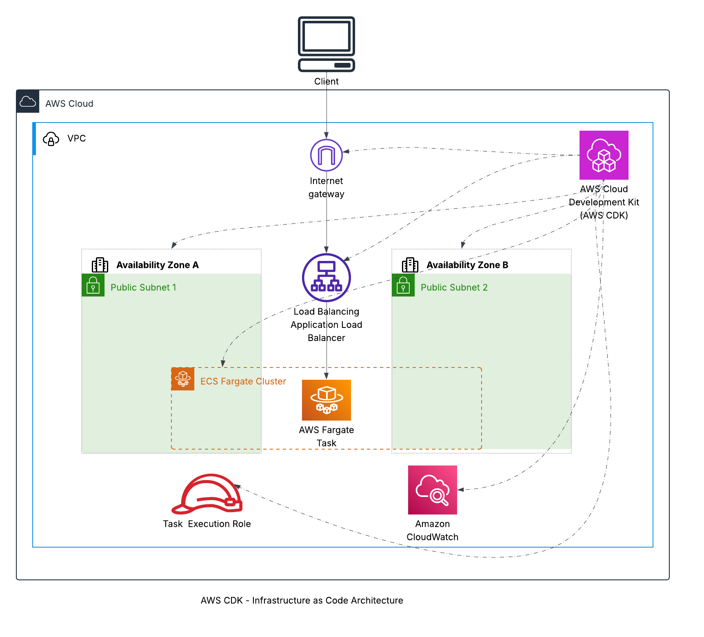

# 🚀 Infrastructure as Code with AWS CDK


🔗 **Live Demo:** [http://cdkinfrastructurestack-alb123456789.us-east-1.elb.amazonaws.com](http://cdkinfrastructurestack-alb123456789.us-east-1.elb.amazonaws.com)

## 📋 Project Overview

This project demonstrates the implementation of Infrastructure as Code (IaC) using AWS Cloud Development Kit (CDK). It showcases how to define, provision, and manage AWS resources using JavaScript code instead of traditional CloudFormation templates or manual configuration.

The infrastructure is designed around a containerized web application deployed on AWS Fargate, with load balancing, auto-scaling, and comprehensive monitoring - all defined and deployed through code.

---

## ✅ Key Features & Services

- 🏗️ **AWS CDK** - Infrastructure as Code with JavaScript
- 🚢 **Amazon ECS** - Container orchestration service
- 🧙‍♂️ **AWS Fargate** - Serverless compute for containers
- ⚖️ **Application Load Balancer** - Traffic distribution and health checks
- 🔐 **IAM Roles** - Secure access control
- 🌐 **VPC** - Isolated network infrastructure
- 📊 **CloudWatch Logs** - Container logging and monitoring

---

## 🖥️ Application in Action


The screenshot above shows the application successfully deployed and running on AWS using the CDK infrastructure. The containerized Nginx web server demonstrates:
- The successful deployment of the container
- Proper configuration of the load balancer
- Functioning health checks
- Seamless container orchestration with ECS Fargate

---

## 🗺️ Architecture Overview



The architecture follows modern serverless container hosting principles, using CDK to define all infrastructure components as code. This eliminates manual configuration while ensuring infrastructure consistency and repeatability.

---

## 📁 Project Structure

```
aws-cdk-infrastructure/
├── app/                          # Application code
│   ├── app.js                    # Node.js Express application
│   ├── package.json              # Node.js dependencies
│   └── Dockerfile                # Container definition
├── cdk/                          # CDK Infrastructure code
│   ├── bin/                      # CDK app entry point
│   │   └── cdk.js                # Main CDK application
│   ├── lib/                      # Stack definitions
│   │   └── cdk-stack.js          # Main infrastructure stack
│   ├── package.json              # CDK dependencies
│   └── cdk.json                  # CDK configuration
├── architecture/                 # Architecture diagrams
│   ├── cdk-architecture-diagram.png  # Architecture diagram
│   └── application-screenshot.png    # Screenshot of running application
├── docs/                         # Additional documentation
│   └── logical-flow.md           # Detailed logical flow explanation
└── README.md                     # Project documentation
```

---

## 🧪 Application Features

The demo application is a containerized web server that:

- Serves static content via Nginx
- Provides robust health check responses
- Demonstrates container deployment best practices
- Showcases serverless container execution on Fargate
- Automatically scales based on demand

This allows for demonstration of container deployment and orchestration without needing to build a custom application.

---

## 🚀 Deployment Process

### Prerequisites
- AWS CLI configured with appropriate permissions
- Node.js v18+ and npm
- AWS CDK v2 installed globally

### Steps

1. **Set up the project structure**
   ```bash
   mkdir -p aws-cdk-infrastructure/{app,cdk/{bin,lib},architecture,docs}
   cd aws-cdk-infrastructure
   ```

2. **Initialize CDK project**
   ```bash
   cd cdk
   cdk init app --language javascript
   ```

3. **Install dependencies**
   ```bash
   npm install aws-cdk-lib @aws-cdk/aws-ec2 @aws-cdk/aws-ecs @aws-cdk/aws-ecr @aws-cdk/aws-iam @aws-cdk/aws-elasticloadbalancingv2 @aws-cdk/aws-logs
   ```

4. **Deploy infrastructure**
   ```bash
   cdk bootstrap  # First-time only
   cdk deploy
   ```

5. **Verify deployment**
   ```bash
   # Access the load balancer DNS shown in the CDK outputs
   # Example: http://CdkInfrastructureStack-ALB123456789.us-east-1.elb.amazonaws.com
   ```

---

## 🧠 Skills Demonstrated

- Infrastructure as Code with AWS CDK
- JavaScript for infrastructure definition
- Containerization with Docker
- AWS ECS and Fargate configuration
- Load balancer setup and health checks
- Container security and IAM roles
- Serverless architecture design
- VPC networking and security groups

---

## 📝 Lessons Learned

- **CDK vs CloudFormation**: While CloudFormation templates are powerful, CDK provides improved developer experience with abstractions and familiar programming languages.
- **Infrastructure Testing**: Being able to write unit tests for infrastructure code is a significant advantage of using a programming language for IaC.
- **Construct Libraries**: Leveraging AWS Construct Library significantly speeds up development compared to writing raw CloudFormation.
- **Security by Design**: Incorporating proper IAM roles, security groups, and networking from the beginning establishes secure foundations.
- **Health Check Configuration**: Properly configuring health checks is critical for stable container deployments in production environments.

---

## 📚 Additional Resources

- [AWS CDK Documentation](https://docs.aws.amazon.com/cdk/latest/guide/home.html)
- [AWS Fargate Documentation](https://docs.aws.amazon.com/AmazonECS/latest/developerguide/AWS_Fargate.html)
- [CDK Patterns](https://cdkpatterns.com/)
- [ECS Task Definitions](https://docs.aws.amazon.com/AmazonECS/latest/developerguide/task_definitions.html)

---

## 🔗 Related Projects

- [Containerized Application on AWS ECS Fargate](https://github.com/jimmyperalta-dev/aws-ecs-fargate-application)
- [Serverless API with AWS Lambda & DynamoDB](https://github.com/jimmyperalta-dev/aws-serverless-dynamodb-api)
- [Static Website on AWS S3](https://github.com/jimmyperalta-dev/aws-s3-static-website)

---

## 👤 Author

**Jimmy Peralta**  
🛠️ Systems Support Engineer | ☁️ AWS Cloud Enthusiast  
🌐 [https://www.deployjimmy.com](https://www.deployjimmy.com)
